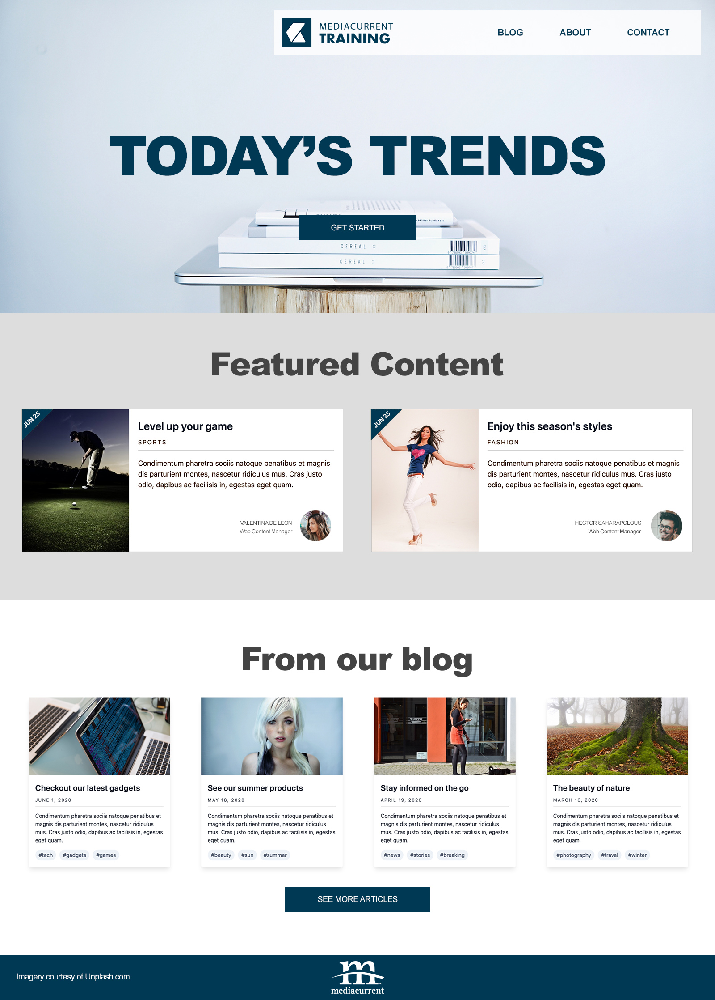

# Welcome

In this two-day hands-on training workshop you will learn the process of identifying, building, and integrating components with Drupal 8 using Pattern Lab and Twig. Drupal 8 best practices will be at the core of the training to ensure components are built in a way that leverage caching, performance and re-usability.

#### This training covers the following topics:

* Principles of Atomic Design for building flexible and scalable components
* Building a custom Drupal 8 theme using [Mediacurrent's Theme Generator](https://github.com/mediacurrent/theme_generator_8)
* Using Pattern Lab and Twig too build flexible and re-usable components
* Twig's **include**, **extends**, **embed**, and **Twig Blocks** to nest and reuse components 
* Debugging a Drupal site using Kint
* Working with and creating Twig template suggestions
* Working with content arrays to get field's values
* Integrating components with Drupal 8
* Using Drupal Views and View Modes with components
* Drupal and Twig best practices
* ... and more

#### At the end of this training you would have learned:

* The principles of Atomic Design and how to take to your advantage to build flexible, reusable components in a Drupal website
* How to build a Drupal 8 theme
* The basics of Twig and how to use it for advance logic on your components
* How to use debugging tools to identify templates and content arrays in drupal pages
* How to integrate Pattern Lab components with Drupal's paragraph types, content types and Views
* ... and more

