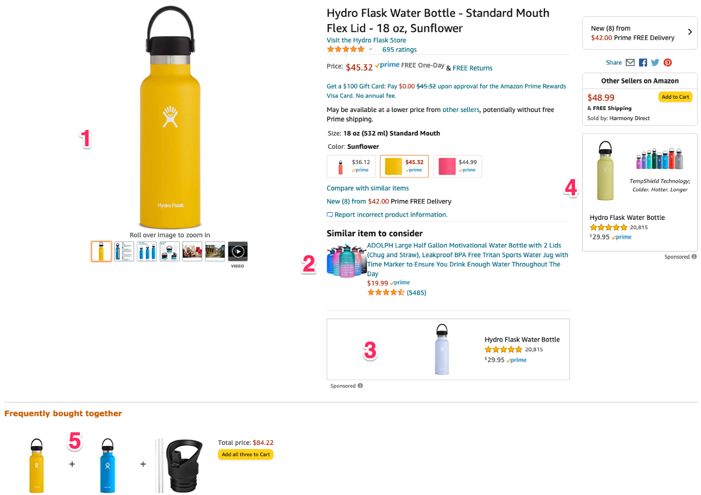

# View modes

### The Amazon example

Drupal provides the ability of creating view modes to be able to display content in many ways.  If we look at the Amazon example above, we have outlined each of the ways in which any product can be displayed.  There are actually many other ways in which a product is displayed in Amazon but we don't have enough room for all of them.  The point is that based on where a product should be displayed, amazon changes the information for each display.  

1. This is the full view of any product.  Here you will see all the details about the product including name, brand, price, dimensions, etc.
2. This option shows us a more compact option for the products which are the rating and a link to a page where they can be found, in addition to the image.
3. This view display is even more compact than the previous one with only an image, name and rating
4. The same is true for this view display option
5. Finally, this option is as bare bones as possible with only the image of the product

Drupal let's us do the same thing for our content.  Whether they are products or article pages.  View mode displays are super powerful and we will make use of them throughout this course.  We will start by creating a new view mode display for the hero.

### Exercise: Create a Hero View Mode Display

As we previously indicated, our heroes will be created from existing article nodes.  This means that if we want our articles to display in different ways like in Amazon, we are going to create different view mode displays.

1. From the admin toolbar click **Structure \| Content types \| Article \| Manage Display**
2. At the bottom of the page expand the **Custom Display Settings** fieldset
3. Click **Manage view modes**
4. Within the table with the heading of **Content** click the link **Add new Content view mode**
5. In the Name field, type **Hero** then click the **Save** button
6. That's it, the vie mode is created... but it is not yet enabled

### Exercise:  Enable the Hero view mode in articles

1. Repeat steps 1 - 3 above
2. Check the box next to **Hero** and click **Save**
3. Now the view mode is enabled but not yet configured for use

### Exercise: Configure the fields to display in Hero view mode

Just like with Amazon, we are now going to determine which fields we want to display when we are viewing an article using the Hero view mode.  Any given article has a large number of fields to display such as the title, body, date, author, image, tags, and others.  However, for our hero, the only fields we need are the Image and Title.  So let's configure them now.

1. While still in the Manage Display screen, click the **Hero** link which should be next to _Default_.  Drupal provides out of the box a couple of view modes such as Default and Teaser as well as Full content.  We will use these later on
2. While in the Hero view mode, you will see all the fields that are part of the Articles.  We only want the Image and title fields so drag all the other fields under the **Disabled** section 
3. For the **Image** field, click the little cog wheel located on the far right of the table row next to image, and select **none \(original image\)**, as the image style then press the **Update** button
4. Click the **Save** button


**WARNING: Where is the title field?**  If you were looking for the title field in the previous exercise, you probably noticed that it is not available.  This is a Drupal thing and I honestly don't know why Drupal does this.  The point is that although the field is not visibly available, it is still being available when the articles renders on the page.  For now, just know that although we can't see the title field, it will still be available when the page renders.


### Exercise: Configure the Hero to display in right format

With the fields in place to display as hero, let's make some final updates to ensure the image and title fields display in the right format.

1. From Drupal's admin toolbar, click **Structure \| Content types \| Homepage \| Manage display**
2. Under the **Label** column select the dropdown and choose **Hidden** to hide the field label
3. Under the **Format** column select **Rendered Entity** from the dropdown
4. Click the cogwheel at the far right of the Hero field
5. For view mode select **Hero** and click the **Update** button
6. Click the **Save** button

With these updates we are telling Drupal that when the hero is rendered in the page, we want to use the Hero view mode display which will give us only the selected article's Image and title and will ignore all other fields for the article.

