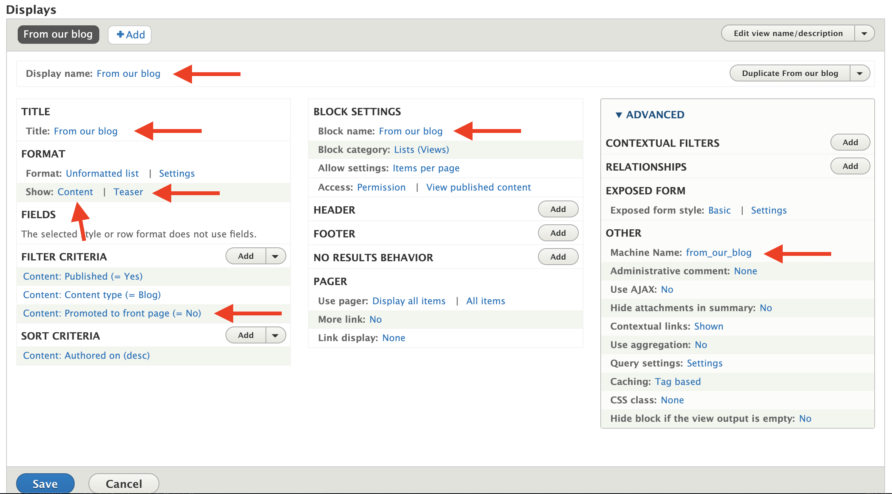
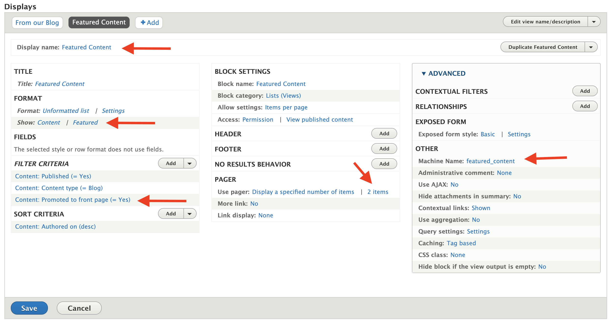

# Drupal Views

To build the _Featured Content_ and _From our blog_ sections we are going to use the power of Drupal's views and View Modes. By querying all Blog content we can generate a list of blog posts, then using View Modes, we can determine the fields we'll expose as well as the format in which fields will be rendered. Drupal Views are database queries you can write and execute using Drupal's UI.

### Exercise: Blog posts View

Let's start by creating a new view to pull all blog posts.  Then we will create two block displays out of the view; one for the Featured Content blog posts, and the other one to show the latest 4 blog posts.

1. From Drupal's Admin toolbar click **Structure \| Views**
2. Click the **Add view** button
3. For View name type **Blog posts**
4. Machine name should auto complete to `blog_posts`
5. For VIEW SETTINGS, **Show** _Content_ **Of type:** _Blog_
6. Check **Create a block** \_\_under BLOCK SETTINGS
7. Type **From our blog** as the block title
8. Clear the value from the **Items per block** field
9. Click the **Save and edit** button

#### Updating the view

1. At the top of the view, change the _Display name ****_ ****to **From our blog** by click the word **Block** and typing the new display name under the _Administrative name_ field, then pressing the **Apply** button.  This helps you distinguish each of your views displays as you work with them.  
2. In the FORMAT section, click **Settings** next to _Unformatted list_ and clear the **Add views row classes** checkbox and then press the **Apply** button.  Since we will be writing our own markup, we don't need Drupal's default classes.
3. Still in the FORMAT section, click **Fields**, then select **Content** and ensure **Teaser** is displayed in the **View mode** dropdown.  Then click the **Apply** button.  As we discussed before, we will use the _Teaser_ view mode to display the 4 articles shown in the _From our blog ****_section.
4. Under FILTER CRITERIA, click the **Add** button, then search for **Promoted to front page** 
5. Check the checkbox next to **Promoted to front page** &gt; _**Content**_, then click the **Add and configure filter criteria** button
6. At the filter criteria window, ensure **is equal to** is the operator, and **No** is the ****_Promoted to front page status_
7. Click _the **Apply** button_
8. Under BLOCK SETTINGS, change the block name to **From our blog** by clicking _block,_ then clicking the **Apply** button.  This will appear as the name of this block in administer &gt;&gt; structure &gt;&gt; blocks.
9. Expand the ADVANCED fieldset to the right of the view page
10. Under _Machine name**,**_ click the current value and change it to **from\_our\_blog**, the click the **Apply** button.  Using a custom and meaningful name ensures our twig template suggestions will use names that make sense. _****_You will see this later.
11. _Finally, save all your changes by pressing the **Save** button._  Failing to press __**Save**, will result in loosing all your changes.

Your view should look like the image below.  _Click on it to zoom in._

### Exercise: Featured Content View

Now we are going to create a new views display for the Featured Content.  We will inherit all the settings from the _From our blog_ display and then we will change things to _Featured content_.


**VERY IMPORTANT**:  On screens where you see a dropdown with the label of **for**, be sure you select **This block \(override\)**.  This means the changes you are making should only apply to the block/display you are currently working with, and not the original block/display we created above.


1. At the top of the new view, just below the word **Displays** click the **+ Add** button next to _From our blog_
2. Choose __**Block** from the dropdown
3. You will follow most of the steps from the **Updating the view** section above, but will make some modifications.
4. First, change any _From our blog_ reference to **Featured content**.  Be sure to the _Machine Name_ reference in step 10, is typed as follows: **featured\_content**.
5. For step 3 above, choose **Featured** as the view mode
6. For step 4, FILTER CRITERIA, click the existing value from _No_ to **Yes** for _Promoted to front page status_.  In addition, and **SUPER IMPORTANT**, change the **for** dropdown to **This block \(override\)**.  This will ensure the changes you are making don't affect the first display we built above.
7. In the middle of the view under **PAGER**, change _All items_ to **2** items to display by clicking the _All items link and typing **2** in the items to display field then pressing the **Apply** button.  This means we will only show two articles as featued content on the homepage._
8. Once you made all the updates, **Save** the view to conserve your changes.

The Featured Content display/block should look like this.  Click on it to zoom in.,

## View Modes

View modes in Drupal are a great ways to display content in different ways. The same type of content can be displayed differently in different pages by managing the fields to show. Most entities in Drupal \(node, views, blocks, paragraph types, media, etc.\), support view modes. In the example of our blog posts, we can show the post's image very large when viewing the post in its full view mode, but show it as a thumbnail when viewing the post in a card as part of the Featured Content view. We will make these configurations shortly.

## Why View Modes?

By default Drupal provides some view modes out of the box. For example, for Content Types, we can use the Default, Full and Teaser view modes. By using view modes we let Drupal add all the logic for how to show/hide your content fields.

A typical view mode to display a minimal version of your nodes is the **Teaser** view mode. This is perfect to only show the fields we want using the Card component.

