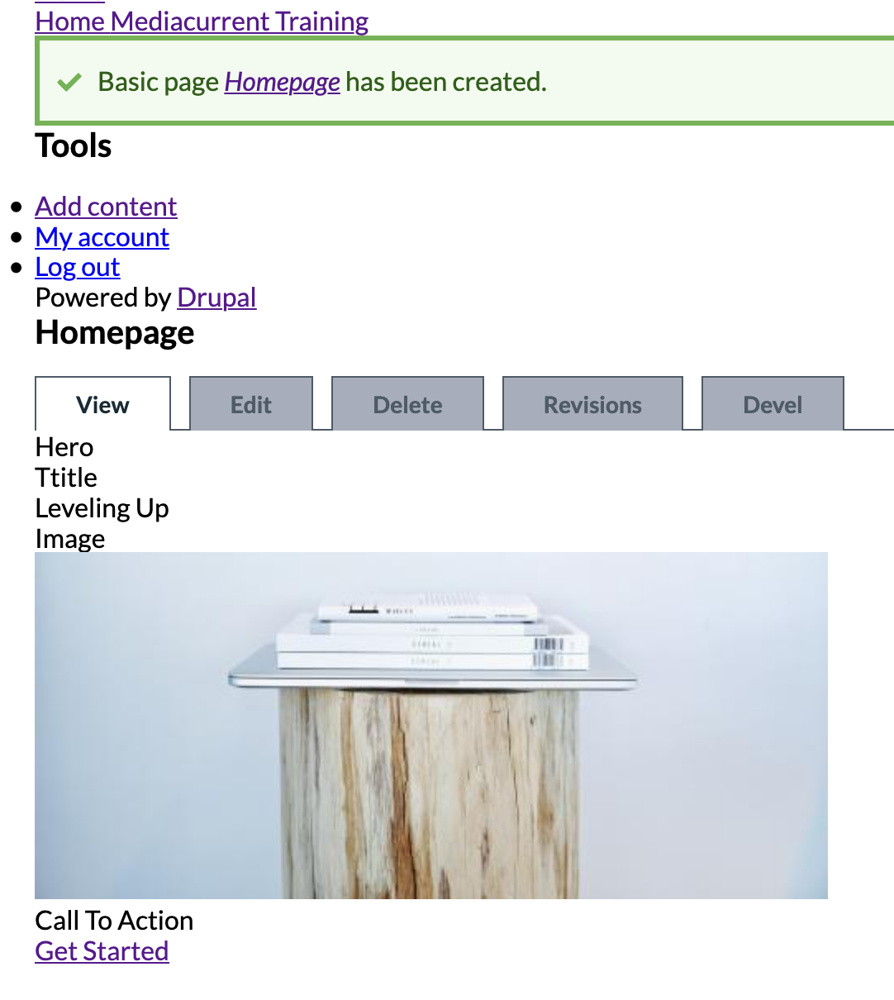

# Hero paragraph type

Using a paragraph type will allow us to reuse these components on any page we need to.


**TIP:** After the Hero paragraph type has been created, you can reuse its fields in other component's paragraph types you will build later.


## Exercise: Create the Hero paragraph type in Drupal

* Launch your local Drupal website and login with Admin rights
* From Drupal's Admin Toolbar, click **Structure &gt; Paragraph Types**
* Click the **Add paragraph type** button
* Assign the Label and Machine name below

  | Label | Machine name |
  | :--- | :--- |
  | Hero | `hero` |

* Click the **Save and manage fields** button

Add the following fields and settings to the paragraph type:

**NOTE:**: All fields use `1` as the **Allowed Number of values**.

| Field label | Machine name | Field type |
| :--- | :--- | :--- |
| Title | `field_title` | Text \(Plain\) |
| Image | `field_image` | Media Reference |
| Call To Action | `field_cta` | Link |

For the Image field, set the following configuration:

* **Media type**: `image`

For the CTA field, set the following configuration:

* **Allowed link type**: _Both internal and external links_
* **Allowed link text**: _Required_

## Putting the new paragraph type to use

Now that the paragraph type is done, it's time to add it to a content type. Paragraph types on their own are useless. They need to be added to other entities such as a content type as an **Entity Reference** field.

## Adding the paragraph type to the Basic Page content type

* From Drupal's Admin Toolbar, click **Structure \| Content Types**
* Click the **Manage fields** button next to **Basic Page**
* Click the **Add field** button
* Under the _Add a new field_ dropdown, scroll to the **Reference Revisions** section and select **Paragraph**

  | Label | Machine name |
  | :--- | :--- |
  | Hero | `field_hero` |

* Click the **Save and continue** button
* Change _Allowed number of values\__ to **Limited - 1**
* In the _Reference Type_ section, choose **Hero** under _Paragraph type_
* Click the **Save settings** button

### Create a new Node with a Hero

Using the Basic page content type, create a new page and add a Hero component in it:

1. From Drupal's Admin toolbar, click **Content**
2. Click the **Add content** button
3. Select **Basic Page**
4. Fill out the Page's title using **Homepage**
5. Then fill out all fields in the Hero paragraph type
6. Ignore the Body field if available
7. Click the **Save** button

After saving your page the hero component should look something similar to this:

It's pretty obvious there are a lot of things that need improvement with our Hero above, but we will get to that shortly.  

