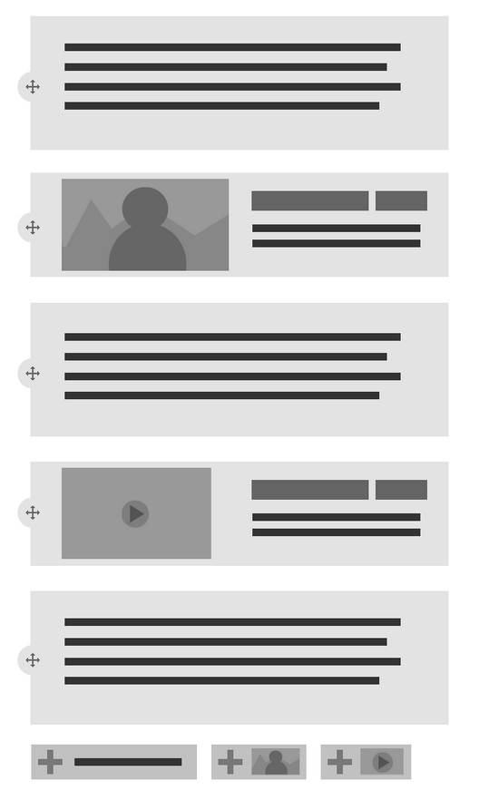

# Building the Hero in Drupal

### Whose line is it anyway?

Before embarquing on this Drupal journey, keep in mind that your role in this process may vary.  Depending on your team, your skillset or other factors, you will most likely not going to do it all.  For example, a typical project for me consists of an architect building all of Drupal's infrastructure, a front-end developer building components in Pattern Lab, and perhaps a back-end developer integrating the components with Drupal.  However, in other projects I may be responsible for building and integrating components.

### Drupal entities

Typically in a component-based project, Drupal will use entities to build the components infrastructure in the back end.  Entities such as content types, blocks, [paragraph](https://www.drupal.org/project/paragraphs) types, and even views, are some of the ways we can transition from a traditional development approach of building pages to a modular system of components.

### Paragraphs module

Paragraphs is a new way of content creation!  It allows you — Site Builders — to make things cleaner so that you can give more editing power to your end-users.

Instead of putting all their content in one WYSIWYG body field including images and videos, end-users can now choose on-the-fly between pre-defined Paragraph Types independent from one another. Paragraph Types can be anything you want from a simple text block or image to a complex and configurable slideshow.

Using a paragraph type for the Hero and other components will allow us to reuse these components on any page we need to. In Drupal we will build a custom paragraph type called Hero.  This custom entity will contain the same fields we identified when building the Hero component in Pattern Lab \(image, title, and CTA\). 


**TIP:** After the Hero paragraph type has been created, you can reuse its fields in other paragraph types you will build later.


### Exercise: Create the Hero paragraph type in Drupal

1. Open your local Drupal website and login with Admin rights
2. From Drupal's Admin Toolbar, click **Structure &gt; Paragraph Types**
3. Click the **Add paragraph type** button
4. Assign the Label and Machine name below

   | Label | Machine name |
   | :--- | :--- |
   | Hero | `hero` |

5. Click the **Save and manage fields** button

Add the following fields and settings to the paragraph type:

**NOTE:**: All fields use `1` as the **Allowed Number of values**.

| Field label | Machine name | Field type |
| :--- | :--- | :--- |
| Title | `field_title` | Text \(Plain\) |
| Image | `field_image` | Media Reference |
| Call To Action | `field_cta` | Link |

For the Image field, set the following configuration:

* **Media type**: `image`

For the CTA field, set the following configuration:

* **Allowed link type**: _Both internal and external links_
* **Allowed link text**: _Required_

### Putting the new paragraph type to use

Paragraph types on their own are useless. They need to be added to other entities such as a content type as an **Entity Reference** field.

### Adding the paragraph type to the Basic Page content type

1. From Drupal's Admin Toolbar, click **Structure \| Content Types**
2. Click the **Manage fields** button next to **Basic Page**
3. Click the **Add field** button
4. Under the _Add a new field_ dropdown, scroll to the **Reference Revisions** section and select **Paragraph**

   | Label | Machine name |
   | :--- | :--- |
   | Hero | `field_hero` |

5. Click the **Save and continue** button
6. Change _Allowed number of values\__ to **Limited - 1**
7. In the _Reference Type_ section, choose **Hero** under _Paragraph type_
8. Click the **Save settings** button

### Create a new Node with a Hero

Using the Basic page content type, create a new page and add a Hero component in it:

1. From Drupal's Admin toolbar, click **Content**
2. Click the **Add content** button
3. Select **Basic Page**
4. Fill out the Page's title using **Homepage**
5. Then fill out all fields in the Hero paragraph type
6. Ignore the Body field if available
7. Click the **Save** button

After saving your page the hero component should look something similar to this:

It's pretty obvious there are a lot of things that need improvement with our Hero above, but we will get to that shortly.  

