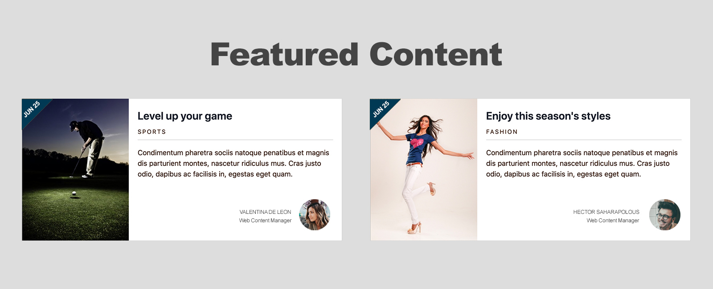

# Featured Content

So far we've been building individual components and built them in a way we can re-use them. Well, the time has come to build a list of content where we will re-use most components we've built. This is where component-based shines. By looking at the design comp below, we can see that we will be showing a collection of cards. In addition, the section has a title of "Featured Content" .



### Component data

1. Inside `src/patterns/components`create a new folder called **featured-content**
2. Inside the _featured-content_ folder create a new file called `featured-content.json`
3. Inside _featured-content.json_ add the following code:



```yml
{
  "heading": {
    "heading_level": "2",
    "modifier": "heading--large center section-header",
    "title": "Featured Content",
    "url": ""
  },
  "items": [
    {
      "image": "",
      "heading": {
        "heading_level": "3",
        "modifier": "card__title",
        "title": "The beauty of nature",
        "url": "#"
      },
      "date": "Jun 25",
      "category": "Sports",
      "body_text": "Curabitur blandit tempus porttitor. Vestibulum id ligula porta felis euismod semper. Vivamus sgittis lacus vel augue laoreet.",
      "author": {
        "photo": "",
        "name": "Valentina De Leon",
        "title": "Digital Strategist"
      },
      "modifier": "card--wide"
    },
    {
      "image": "",
      "heading": {
        "heading_level": "3",
        "modifier": "card__title",
        "title": "The beauty of nature",
        "url": "#"
      },
      "date": "Sep 27",
      "category": "Lifestyle",
      "body_text": "Curabitur blandit tempus porttitor. Vestibulum id ligula porta felis euismod semper. Vivamus sgittis lacus vel augue laoreet.",
      "author": {
        "photo": "",
        "name": "Valentina De Leon",
        "title": "Digital Strategist"
      },
      "modifier": "card--wide"
    }
  ]
}
```



There is a lot going on in this file. Let's go over it and you will see that it's actually relatively straight forward.

* First we defined the `heading`  object which will be used as the title for the entire collection.
* At around line 8, we declared an `items` array.  This will help us mimic the array of content to build the collection.
* Each item in the items array represents a card.  Inside each card item we have defined the card's fields \(`image`, `title`, `body_text`, `cta` \).  We have repeated this 3 times to achieve the collection shown in the Featured Content image above.

### Component markup

So the data is ready, let's go ahead and add the markup for the component.

1. Inside the _featured-content_ folder create a new file called `featured-content.twig`
2. Inside _featured-content.twig_ add the following code:



```php
{{ attach_library('training_theme/featured-content') }}

<section class="featured-content{{ modifier ? ' ' ~ modifier }}{{- attributes ? ' ' ~ attributes.class -}}"
  {{- attributes ? attributes|without(class) -}}>
  
    
  

  <div class="featured-content__items">
    
      
        
      
    
  </div>
</section>
```



### Component styles

1. Inside the _hero_ folder create a new file called **featured-content.scss**
2. Inside `featured-content.scss` add this code:



```css
// Import site utilities
@import '../../global/utils/init';

.featured-content {
  @include component-spacing;
  background-color: $color-gray-light;
  padding: 40px 20px 0;

  @include breakpoint($bp-md) {
    padding-bottom: 100px;
  }
}

// On mobile cards are displayed
// vertically as a group.
.featured-content__items {
  align-items: center;
  display: flex;
  flex-direction: column;

  // On larger screens cards are displayed
  // horizontally as a group.
  @media screen and (min-width: $bp-lg) {
    flex-direction: row;
    justify-content: space-around;
  }

  .card {
    margin-bottom: 60px;

    @media screen and (min-width: $bp-xl) {
      flex: 0 0 45%;
      margin-bottom: 0;
    }
  }
}
```



### Don't forget to create the library.


### Compiling the code to generate the Featured Content

While in your theme's root directory, run the following commands in your command line and press **Return**

`npm run build`

`npm run watch`


**TIP:** Since we created a whole new component; if you had the watch task running, it is recommended you stop it by pressing **Ctrl + C** on your keyboard and run the commands above. This will ensure the new component will be generated and all related code will be compiled.


In your browser of choice open the following URL: [http://localhost:3000](http://localhost:3000). This will open Pattern Lab where you can find the Hero component under components.

Next, we are going to build the back-end infrastructure in Drupal for this collection. This also will be a unique approach compared to previous components we've built in Drupal.
